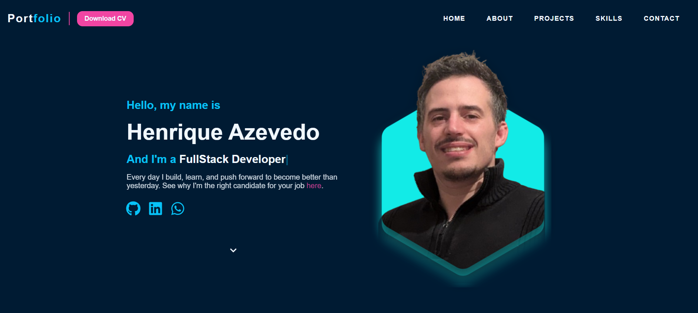
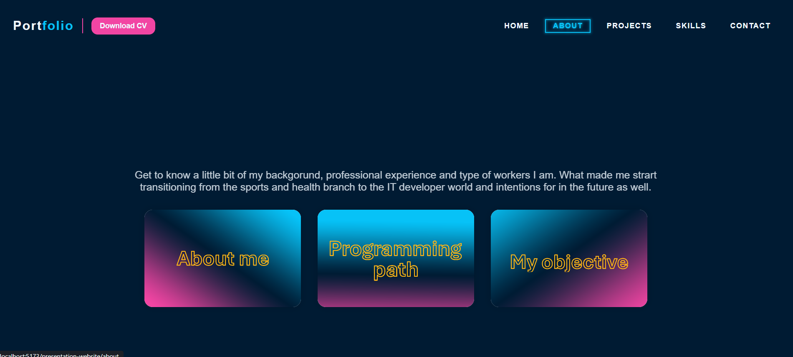
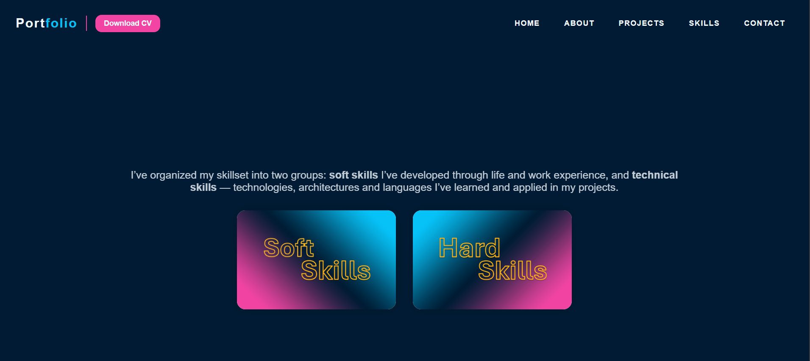
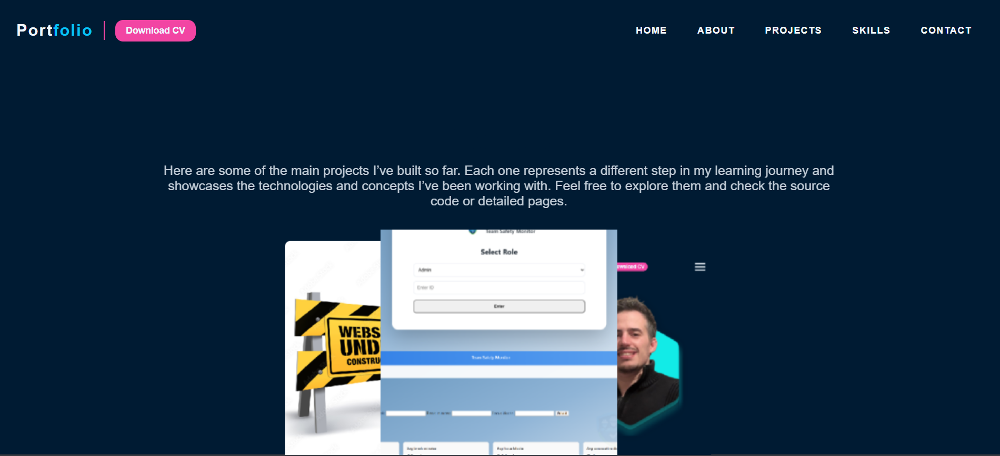
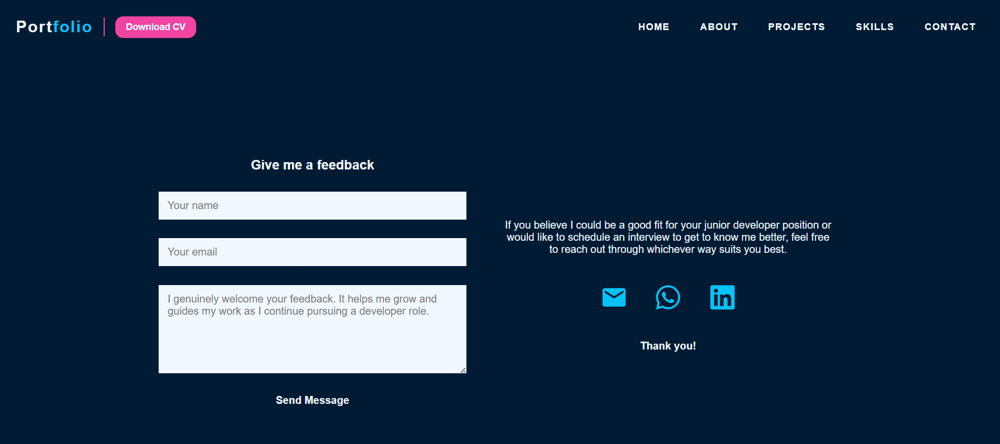

---

# Presentation Website — Portfolio

This project is a modular and scalable personal portfolio built with **React + Vite**, following a clean architecture and component‑driven structure. It presents my professional background, technical skills, projects, and career objectives as a Developer.

The application is organized into **Top Pages** (main sections) and **Bottom Pages** (detailed content), ensuring clarity, maintainability, and easy navigation.

---

## Project Structure

The portfolio is divided into two main layers:

### **Top Pages (Primary Sections)**  
These represent the entry point for each major area of the website:

- Home  
- About  
- Skills  
- Projects  
- Contact  

Each Top Page introduces the section and provides navigation to its detailed content.

### **Bottom Pages (Detailed Content)**  
Each Top Page contains one or more Bottom Pages (except Home adn Contacts):

**About**  
- My Story  
- My Programming Path  
- What Am I Looking For  

**Skills**  
- Hard Skills  
- Soft Skills  

**Projects**  
- Presentation Website  
- Team Safety Monitor  
- Car Dealership App  

This layered structure keeps the project organized and easy to maintain.

---

## Component Architecture

The project uses a reusable component system to ensure consistency and reduce duplication.

### Core Components
- Header / NavBar  
- GenericSectionPage  
- GenericAboutPage  
- GenericProjectsTopPage  
- ProjectCard  
- ScrollButton  
- MediaButton  
- LinkButton  
- NavButton  

### Project‑Specific Components
- ProjectsCarousel (Desktop & Mobile)  
- HardSkillCard  
- SkillCard  

### Utilities
- ScrollToTop  

### assets
- Global css reset and variables, aplied in every place on the site.
---

## Screenshots

### Home


### About


### Skills


### Projects


### Contact



---

## Recent Improvements

- Removed the old **HomeBottomPage**  
- Refactored some navigation and routing  
- Temporarely removed Google Calendar
- Improved folder structure for scalability  
- Added support for dynamic asset paths using `import.meta.env.BASE_URL` for GitHub Pages compatibility wity the CV pdf files  

---

## Purpose

This portfolio was built to:

- Present my professional journey  
- Demonstrate my technical and soft skills  
- Showcase real projects with clear structure  
- Show the importance I give to a well‑presented design and structure
- Reflect my mindset as a developer: organized, detail‑oriented, and growth‑driven  

---

## Roadmap

Planned enhancements include:

- Endind refactoring and change folders names to a better practice 
- Expansion of the Projects section  
- Global theme system (Dark/Light mode)  

---

## Folder Structure (Simplified)

```
src/
 ├── assets/
 ├── components/
 ├── data/
 ├── Pages/
 │    ├── Home/
 │    ├── About/
 │    ├── Skills/
 │    ├── Projects/
 │    └── Contact/
 ├── utils/
 ├── App.jsx
 └── main.jsx

public/
 └── assets/
      └── cv/
```

---

## Author

**Henrique Almeida Azevedo**  
Web Developer  

- LinkedIn: https://www.linkedin.com/in/henrique-s-azevedo/  
- GitHub: https://github.com/henrique-s-azevedo  


---